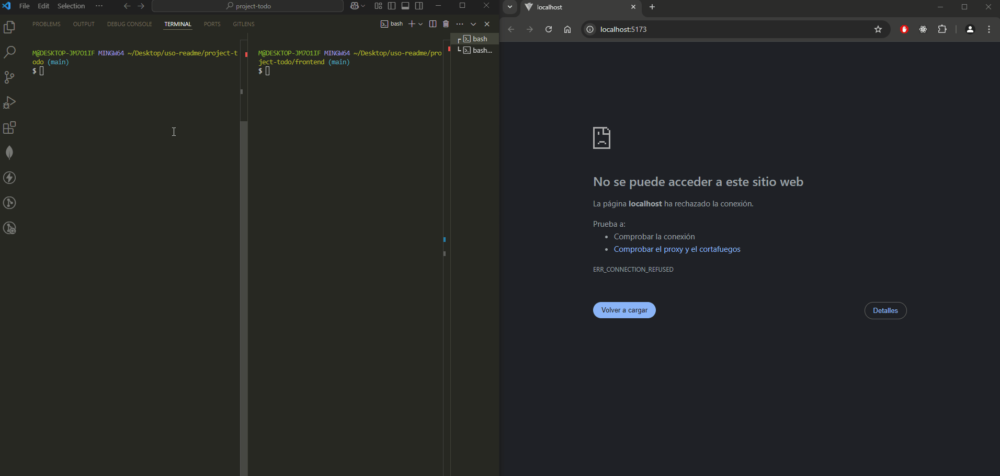

# CRUD API with MongoDB, ExpressJS, NodeJS & React

## About Project
Simple application using the MERN stack. Also testing the front-end framework React Bootstrap

The App handles the creation, retrieval, updating and deletion of data (*CRUD Operations*) in this case, for Teachers information.


### Folder Structure Overview
```
.
├── config
│   └── db.js
├── controllers
│   └── teachersController.js
├── models
│   └── TeachersModel.js
├── routes
│   └── api
│       └── teachersRoutes.js
├── .env
└── frontend
    ├── src
    │   ├── components
    │   │   └── TeachersTable.jsx
    │   ├── pages
    │   │   └── HomePage.jsx
    │   ├── App.jsx
    │   └── main.jsx
    └── .env
```


### Path Overview: 
- *Backend:* ``~/Desktop/project-todo``
- *Frontend:* ``~/Desktop/project-todo/frontend``

## Getting Started

### Installation
1. Clone the repo
```
    git clone https://github.com/mauriciorfdev/project-todo.git
```

2. Install NPM Packages (*On Backend & Frontend*)
```
npm install
```

3. Enter each API KEY (*.env* file) for:

- __BACKEND__:
```
    MONGO_URI = <your string>
```
- __FRONTEND__ ( *TeachersTable Component* ):

```
    VITE_API_URL = http://localhost:5000/api/teachers
```

### Usage
- Navigate to the Root Directory (project-name)
1. Run the Backend Server: ``npm run dev``
```
Server listen on port 5000...
Connected to MongoDB Atlas!
```
2. Change to the Frontend directory: ``cd frontend`` and then:
3. Run the Frontend Server: ``npm run dev`` 
```
VITE v5.4.11  ready in 258 ms

  ➜  Local:   http://localhost:5173/
  ➜  Network: use --host to expose
  ➜  press h + enter to show help
```

#### *Usage Demo*

